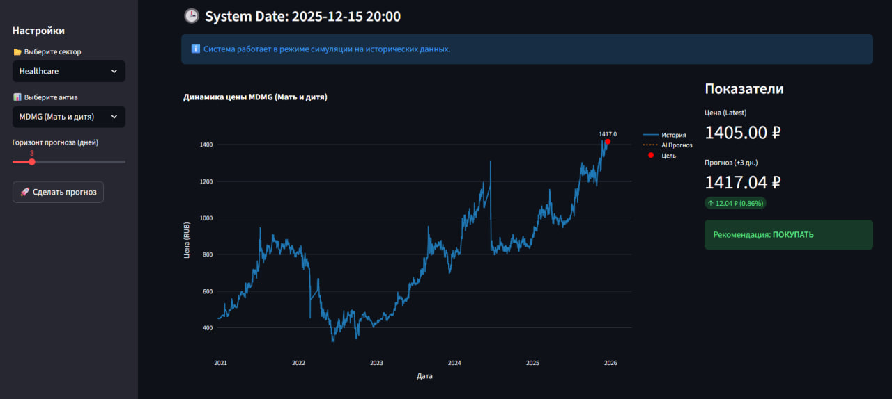
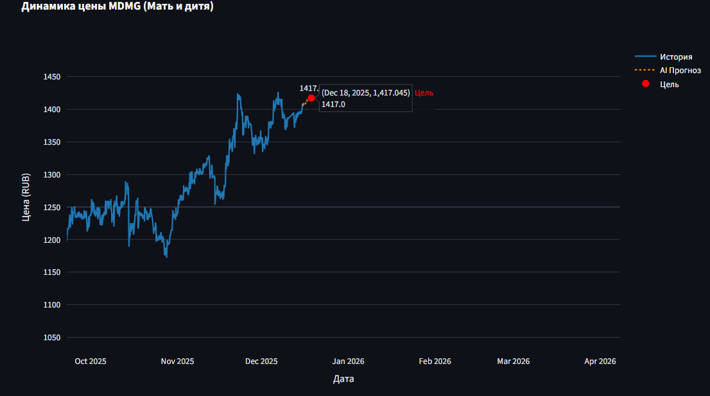

## **StreamStonks**: An end-to-end MLOps platform for real-time stock price prediction.  
Built with microservices architecture using Kafka, PostgreSQL, CatBoost, and Streamlit.  
Features automated data ingestion, scheduled model retraining, and system health monitoring via Grafana.  

Цены акций выгружаются с помощью [T-Invest API](https://www.tinkoff.ru/invest/)
## ✏️ Структура проекта

```
project/
├── docker-compose.yml        # Описывает запуск всех сервисов
├── Dockerfile                # Единая инструкция сборки (копирует всё)
├── .env                      # Пароли и токены
├── requirements.txt          # Список библиотек
├── catboost_model.cbm        # (Опционально) Резервная копия модели в корне
│
├── ingest/                   # СЕРВИС ЗАГРУЗКИ ДАННЫХ
│   └── ingest.py             # Скрипт загрузки
│
├── ml/                       # ML СЕРВИСЫ
│   ├── ml_worker.py          # Обработка Kafka сообщений
│   ├── train_model.py        # Обучение модели
│   ├── scheduler.py          # Планировщик переобучения
│   └── catboost_model.cbm    # Файл модели
│
├── dashboard/                # UI СЕРВИС
│   └── dashboard.py          # Streamlit приложение
│
├── db_init/                  # ИНИЦИАЛИЗАЦИЯ БД
│   ├── schema.sql            # Таблицы 
│   └── dump.sql              # Начальные данные
│
├── shared_models/            # (Пустая папка) Создается Docker-ом для обмена файлами
│
├── grafana/                  # НАСТРОЙКИ МОНИТОРИНГА
│   ├── provisioning/
│   │   ├── datasources/
│   │   │   └── datasource.yml
│   │   └── dashboards/
│   │       └── dashboard.yml
│   └── dashboards_json/
│       └── dashboard.json
└── README.md
```
## 🧠Логика работы системыПроект реализует **полный цикл MLOps (End-to-End)**: от сбора сырых данных до инференса и мониторинга в реальном времени. Архитектура построена на принципе микросервисов, общающихся через базу данных и брокер сообщений.

### 1. Data Pipeline (Сбор данных)* **Сервис:** `ingest_worker`
* **Логика:**
* При первом запуске скрипт скачивает исторические данные (свечи) за последние **5 лет** через **T-Invest API**. (но в проекте есть `db_init/dump.sql.gz`, поэтому при его загрузке данные загрузятся только за промежуток после 5-ти лет, начиная с 10.12.2025)
* Далее переходит в режим инкрементальной загрузки: каждые 10 минут проверяет новые свечи и дописывает их в PostgreSQL.
* На лету рассчитываются технические индикаторы (**RSI, MACD**) и обогащаются метаданными (день недели, время суток).


### 2. ML Training (Обучение)* **Сервис:** `ml_scheduler` + `train_model`
Модели далеко до хорошей, по-сути это baseline
* **Алгоритм:** Градиентный бустинг (**CatBoostRegressor**).
* **Target Engineering:** Модель предсказывает не абсолютную цену, а **отношение** будущей цены к текущей (`target_ratio`). Это позволяет модели быть устойчивой к инфляции и изменению масштаба цен.
* **Автоматизация:** Планировщик запускает переобучение каждые **12 часов**.
* **Versioning:** Новая модель сохраняется в `shared volume`. Воркер предсказаний (`ml_worker`) автоматически подхватывает обновленный файл модели без перезапуска контейнера (**Hot Swap**).

### 3. Event-Driven Inference (Прогнозы)Система использует асинхронную архитектуру для обработки запросов пользователей:

1. **Запрос:** Пользователь выбирает тикер и горизонт прогноза в **Streamlit**.
2. **Очередь:** UI не блокируется, а отправляет задачу (JSON) в топик **Kafka** (`predict_requests`).
3. **Обработка:** `ml_worker` вычитывает сообщение из Kafka.
4. **Рекурсивный прогноз:**
* Модель берет последние реальные данные из БД.
* Делает прогноз на 1 шаг вперед.
* Использует предсказанное значение как входные данные для следующего шага (Autoregressive approach).


5. **Результат:** Прогноз записывается в БД, и Streamlit отображает его пользователю (Long Polling).

### 4. Monitoring (Наблюдаемость)* **Grafana** подключена напрямую к PostgreSQL.
* Собираются метрики качества системы:
* **Latency:** Время обработки запроса ML-воркером.
* **RPS:** Количество запросов на прогноз.
* **Drift Detection:** Сравнение распределения предсказанных цен (рост/падение).
* **Data Health:** Проверка актуальности данных (когда была последняя загрузка свечей).

## 🌐 Доступ к сервисам и Порты

После запуска контейнеров через `docker-compose up -d`, сервисы будут доступны по следующим адресам:

### 🖥️ Веб-интерфейсы

| Сервис | URL | Порт | Описание |
| :--- | :--- | :--- | :--- |
| **Streamlit UI** | **[http://localhost:8501](http://localhost:8501)** | `8501` | Основной дашборд приложения (прогнозы и графики) |
| **Grafana** | **[http://localhost:3000](http://localhost:3000)** | `3000` | Мониторинг метрик и логов. <br>*(Логин/пароль по умолчанию: `admin` / `admin`)* |

### ⚙️ Инфраструктура и Базы данных

| Сервис | Адрес хоста | Порт | Описание |
| :--- | :--- | :--- | :--- |
| **PostgreSQL** | `localhost` | `5432` | Основная база данных (`market_db`) |
| **Kafka (External)**| `localhost` | `9095` | Брокер сообщений (доступ снаружи контейнеров) |
| **Kafka (Internal)**| `kafka` | `9092` | Внутренний порт для общения контейнеров |
| **Zookeeper** | `localhost` | `2181` | Координатор Kafka |

### 🤖 Фоновые воркеры (без открытых портов)
Следующие контейнеры работают в фоне и не требуют прямого подключения:
* `ingest_worker` — Загрузка данных
* `ml_worker` — ML-инференс
* `ml_scheduler` — Планировщик дообучения


### 📊MLOps Dashboard (Grafana)Дашборд предназначен для мониторинга производительности ML-сервиса и состояния данных.

**Ключевые панели:**

* **System Health:** Текущая нагрузка (RPS), среднее время инференса модели (Latency) и общее число запросов.
* **ML Analytics:** Распределение запросов по популярным тикерам и тренды прогнозов (соотношение предсказаний "Рост" vs "Падение").
* **Data Quality:** Количество собранных исторических свечей и мониторинг актуальности последних цен.
* **Logs:** Детальная таблица последних 100 запросов с параметрами прогноза и временем обработки.


### 🚀Запуск

```bash
git clone https://github.com/uroplatus666/StreamStonks.git
cd StreamStonks
# Сборка и запуск всех сервисов
docker-compose up -d --build
```

### 📈Streamlit UI

__________________________________________________


__________________________________________________


